Deploy DKIM in IIS SMTP Service
==================================

**IIS SMTP Server** is a common Windows built-in SMTP service.
**DKIM** is a method for associating a domain name to an email message, 
thereby allowing email sender claims some responsibility for the email. 
In this tutorial, I will introduce how to add DKIM signature to 
outgoing emails in IIS SMTP server.

.. contents:: Sections:
  :local:
  :depth: 1

How DKIM works？
----------------

DKIM combines of a public key cryptography and a DNS to provide credible 
domain-level authentication for email. 

When an email claims to originate from a certain domain, DKIM provides a 
mechanism by which the recipient system can credibly determine that the 
email did in fact originate from a person or system authorized to send 
email for that domain. 

Therefore, to sign an email with DKIM in IIS SMTP Server, you MUST have 
a private key/public key pair for email signing. The work flow is 
illustrated as follows: 

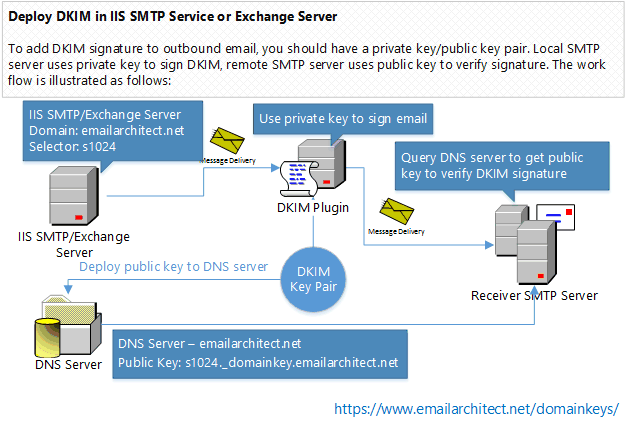

Because DKIM signer uses private key to sign the email, recipient system 
uses public key to verify the signature, therefore, if signer doesn't expose 
the private key to third-party, the DKIM signature cannot be faked. 

Install DKIM in IIS SMTP Service
--------------------------------

To enable DKIM signature in IIS SMTP server, you should download 
the `DKIM Installer <https://www.emailarchitect.net/webapp/download/eaexchdomainkeys.exe>`_ 
and install it on your server at first. 

Double click installer file and the installation will be executed automatically. 
Installer requires IIS SMTP server to be installed. If no IIS SMTP Services detected 
in your operation system, Setup will be aborted. 

After the installation is completed, click "**DKIM Plugin Manager**"
from "**Windows Start menu**" -> "**All Programs**" -> 
"**EA DKIM for IIS SMTP and Exchange Server**" to begin the setup.

.. note:: 
  After the installation is completed, please check "**IIS Admin**" 
  and "**Simple Mail Transfer Protocol (SMTP)**" in "**Control Panel**" 
  -> "**Administrative Tools**" -> "**Services**", and make sure those 
  services are running, if those service are not running, please start it.

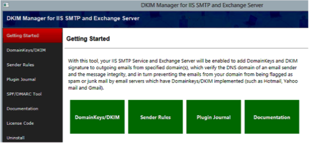
   

Create DKIM for Domain
-----------------------

Click "**Domainkeys/DKIM**" in Manager and click "**New**" to create 
a new domain DKIM signature. DKIM signature is based on the domain of 
sender email address. It is unrelated to the server name. For example, 
if you want to sign the email from ``*@emailarchitect.net``, please 
input ``emailarchitect.net`` to Sender Domain.

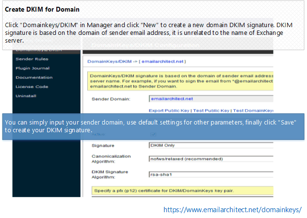
   
You can simply input your sender domain, use default settings for other 
parameters, finally click "**Save**" to create your DKIM signature.

DKIM Parameters
----------------

Here is the detailed information about DKIM parameters:

.. csv-table:: 
  :header: "Parameters", "Description"

  "Sender Domain", "DKIM signature is based on the domain of sender email address. It is nothing about your server name. For example, if you want to sign the email from \*@emailarchitect.net, please input emailarchitect.net to Sender Domain."
     
     
Verify DKIM Installation
-------------------------

After you created DKIM for your domain, you can have a test with this 
online tools:

  - Open http://www.appmaildev.com/en/dkim;
  - Click "Next Step", you will get a test email address; 
  - Finally send an email to this email address, please make sure your 
    sender address is belong to this domain, otherwise, DKIM signature 
    won't be signed. A DKIM report will be sent to your sender email address 
    in a short time.

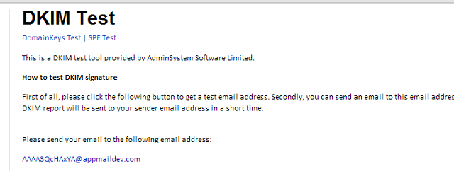

.. note::

  This test email address will be expired after 3 hours, 
  so I suggest that you refresh the tool page and get a new test 
  email address before you send test email every time.     
  
You will receive a report in your sender mailbox like this:  

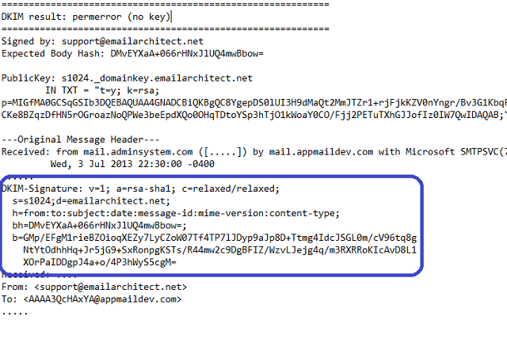
 
Because you didn't deploy DKIM public key to DNS server, so you will 
get an error about "**no key**". But if there is a header named "**DKIM-Signature**" 
in the report, that means DKIM signature is added to your email. Now we need to 
deploy DKIM public key to your domain DNS server.  

Deploy DKIM Public Key
-----------------------

As I introduced "**How DKIM works**", the recipient mail system need to 
query public key to verify DKIM signature. So we need to deploy DKIM public 
key to domain DNS server, then recipient system can query it by DNS server. 
Now we get back to DKIM manager and select your domain and click "**Export Public Key**":

A dialog box will pop up and display a Public Key and a TXT record for 
deployment in your DNS server.

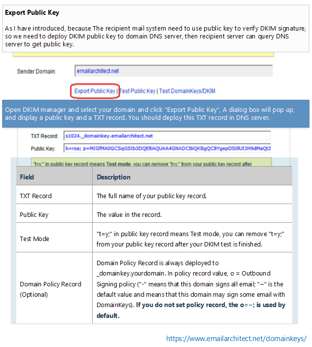
  
Here is record detailed information:

Deploy DKIM Public Key in Windows DNS Server
^^^^^^^^^^^^^^^^^^^^^^^^^^^^^^^^^^^^^^^^^^^^^^^

If your domain is hosted by Windows DNS Server in local LAN. After you 
added a domain in DKIM Plugin Manager, you can select the domain and 
click "**Deploy Key**", input your DNS server address and choose the DNS 
zone, the public key will be deployed to DNS server automatically.

If your domain is not hosted by Windows DNS server in local LAN, or it 
is failed by "**Deploy Key**" in DKIM manager, please deploy public key 
manually as follows:

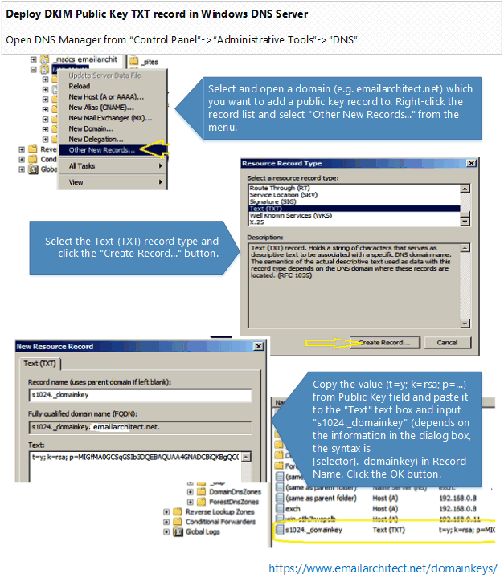

Add DKIM Policy record in Windows DNS Server (Optional*)
^^^^^^^^^^^^^^^^^^^^^^^^^^^^^^^^^^^^^^^^^^^^^^^^^^^^^^^^^^

  - Select and open a domain (e.g. emailarchitect.net) which you want to 
    add a public key record to. Right-click the record list and select 
    "**Other New Records...**" from the menu.
  - Select the Text (TXT) record type and click the "**Create Record...**" button.
  - Copy the value (t=y; o=~;) from Policy field and paste it to the "Text" 
    text box and input "**_domainkey**" in Record Name. Click the OK button.
    
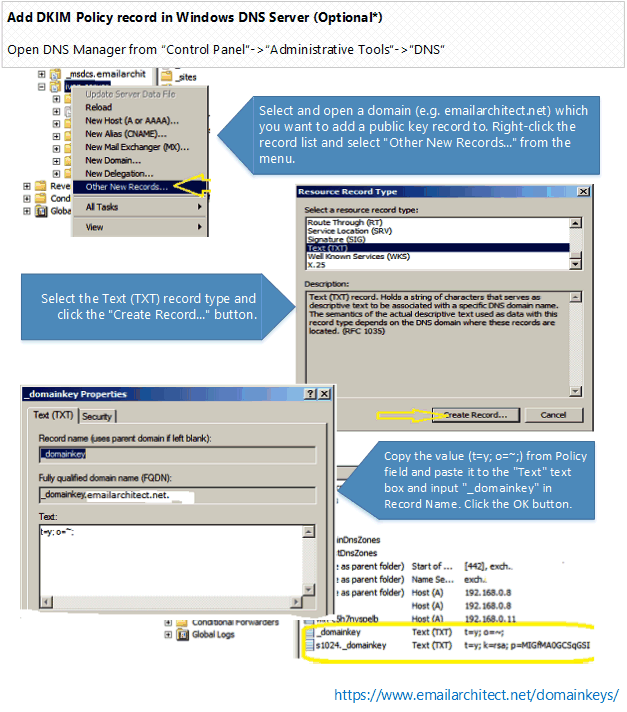
  
Deploy DKIM Public Key in Network Solutions DNS server
^^^^^^^^^^^^^^^^^^^^^^^^^^^^^^^^^^^^^^^^^^^^^^^^^^^^^^^

If your domain is hosted by www.networksolutions.com, you can deploy your public 
key like this:
  
  - Select your domain;
  - Select the "**Edit TXT Record**";
  - Copy the value ``k=rsa; p=...`` from Public Key field and paste it to the 
    "**Text**" text box and input "**s1024._domainkey**" (depends on the information 
    in the dialog box, the syntax is ``[selector]._domainkey``) in Host. Click the 
    "**Continue**" button.
  - (optional*): Copy the value ``o=~;`` from Policy field and paste it to the 
    "**Text**" text box and input "**_domainkey**" in Host. Click the OK button.
    
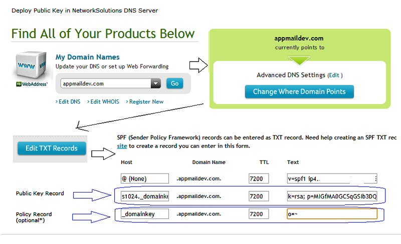
  
Deploy DKIM Public Key in BIND Server
^^^^^^^^^^^^^^^^^^^^^^^^^^^^^^^^^^^^^^

If your domain is hosted by Bind DNS server, you can add DKIM public key record like this: 
locate your domain's zone file and open it with your preferred editor, 
then add the following content:

.. code-block:: batch
  
  ; DKIM policy record
  _domainkey.yourdomain.com.          IN     TXT    "o=~;"
  ; DKIM public key record
  s1024._domainkey.yourdomain.com.    IN     TXT    "k=rsa;p=MIGfMA0GCS....IW7QwIDAQAB"
  
Deploy DKIM Public Key in other DNS server
^^^^^^^^^^^^^^^^^^^^^^^^^^^^^^^^^^^^^^^^^^^^^^^

If your domain is hosted by other ISP, as most ISP provide DNS Web administration 
like "network solutions" do, you can refer to "Deploy Public Key in Network Solutions DNS server" 
section and deploy your public key in your ISP DNS Web administrative tool.

If you are not DNS server administrator, or your domain is hosted by other DNS server, 
please send the information in dialog box -> "**DNS Public Deployment**" to your domain DNS server 
administrator for assistant.

Test DKIM
------------

Now you can have a test with this online tools:

  - Open http://www.appmaildev.com/en/dkim ;  
  - Click "Next Step", you will get a test email address;
  - Finally you can send an email to this email address, please make sure 
    your sender address is belong to this domain, otherwise, DKIM signature 
    won't be signed. A DKIM report will be sent to your sender email address in a short time.

.. attention:: 
  
  This test email address will be expired after 3 hours, so I suggest that you refresh the tool 
  page and get a new test email address before you send test email every time.

You will receive a report in your sender mailbox like this:

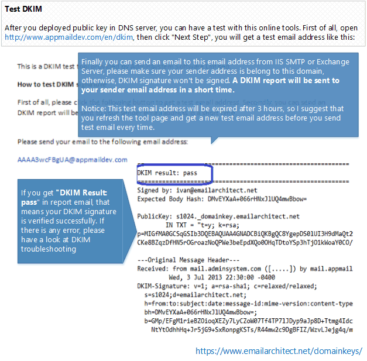
  
If you get ``"DKIM Result: pass"`` in report email, that means your DKIM signature 
is verified successfully. If there is any error, please have a look at following section.

DKIM Troubleshooting
----------------------

No DKIM Signature
^^^^^^^^^^^^^^^^^^

If your email doesn't have **DKIM-Signature** header in the original message, you 
should check the followings:

  - Check your email sender, please make sure your from address is ``*@yourdomain``, and you 
    have set the domain in DKIM. As DKIM signature is based on the email sender, 
    if the sender domain is not set in DKIM Manager, the email won't be signed.
  - Check your log file for any error message.
  - If there is error logged, please contact support@emailarchitect.net for assistance.
  - If there is no error in the log file, you need to verify the DKIM installation.

Verify IIS SMTP/Exchange 2000/2003 Installation
^^^^^^^^^^^^^^^^^^^^^^^^^^^^^^^^^^^^^^^^^^^^^^^^

**Installation Permission**

When you install DKIM on IIS SMTP service, please make sure you are using 
"**Administrator**" user to run the installer.

If you installed EA DomainKeys on IIS SMTP Service, go to 
directory to *EA DomainKeys installation path\\installer*, open DOS prompt and input:

.. code-block:: batch

  cscript smtpregex.vbs /enum
  
Press enter and check if there is "**EA DomainKeys Sink**" installed in the output.

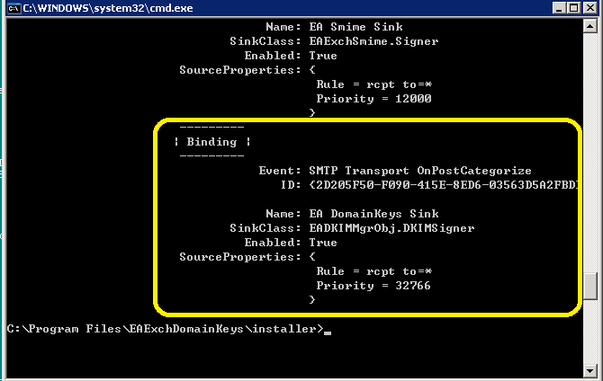

If there is no EA DomainKeys Agent, you can re-run the installer directly (do not uninstall) 
to fix this problem. You can also contact support@emailarchitect.net for assistance.

No Key
^^^^^^^^^^^^^^

This error means your public key is not deployed to DNS server, please see 
"**Deploy DKIM Public Key**" section.

Wrong Body Hash
^^^^^^^^^^^^^^^^

It is likely that the MTA changed email content (disclaimer software or anti-virus software). 
Please go to DKIM setting, check "**Sign a part of message**" and set "**Maximum length of message body to sign**" to zero, then try it again.

Failed to Verify DKIM Signature (wrong body hash, bad signature)
^^^^^^^^^^^^^^^^^^^^^^^^^^^^^^^^^^^^^^^^^^^^^^^^^^^^^^^^^^^^^^^^^
If your email has DKIM-Signature header, but it couldn't be verified by this online tool, 
you should go to DKIM setting and test your public key again to make sure your public key is ok. 
If your public key is ok, please contact support@emailarchitect.net for assistance.

Now IIS SMTP service can add DKIM signature to outgoing emails from your domain.
If you want to send email from other domain, you can simply add the domain from DKIM manager.

In the following section, I will introduce some advanced DKIM feature.

DKIM Selector
--------------

To support multiple concurrent public keys per sending domain, the DNS namespace is further subdivided 
with ``selectors``. Selectors are arbitrary names below the ``_domainkey.`` namespace. For example, 
selectors may indicate the names of your server locations (e.g., "mta1", "mta2", and "mta2"), 
the signing date (e.g., "january2005", "february2005", etc.), or even the individual user.

The most important thing is: selector indicates your DKIM public key location. For example: 
if your domain selector is: ``s1024``, your public key record should be ``s1024._domainkey.yourdomain``; 
if your domain selector is: ``mta1``, your public key record should be ``mta1._domainkey.yourdomain``.

DKIM Selector Usage
^^^^^^^^^^^^^^^^^^^^

If you have only one server and you only set the DKIM/DomainKeys on this server, 
you can give your selector any name. For example: your domain name is: ``emailarchitect.net`` and 
your selector is: ``s1024``, you should deploy your public key to ``s1024._domainkey.emailarchitect.net``.
After the receiver received your email, the receiver can query the public key from 
``s1024._domainkey.emailarchitect.net`` to verify your DomainKeys/DKIM signature. 

.. note:: If you have only one server, you can skip the this sections.

Using a single DKIM selector with the same domain on multiple IIS SMTP servers
^^^^^^^^^^^^^^^^^^^^^^^^^^^^^^^^^^^^^^^^^^^^^^^^^^^^^^^^^^^^^^^^^^^^^^^^^^^^^^^

If all of your servers are running with EA DomainKeys, you should deploy the 
certificate as follows: 

  - Install DKIM on the first server, 
    and create the certificate for the domain.
  - Then install DKIM on other servers, 
    and copy the ``*.pfx`` certificate you created on the first server to other servers.
    The certificate path is *EA DomainKeys installation path\\certs* ;
  - Finally, when you create the DomainKeys/DKIM on other server, please have 
    "**I have a key pair certificate ...**" selected, and import the ``*.pfx`` file 
    from your local disk and input the "TMP001" (default password) as the password. 

All of your servers have the same certificate (private/public key pair) for your domain. 
Please also make sure you use the same selector ``s1024`` (default name).

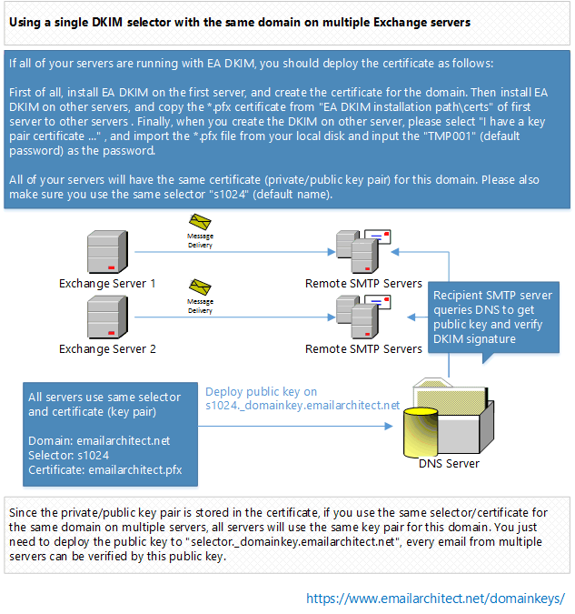
  
Since the private/public key pair is stored in the certificate, if you use the 
same selector/certificate for the same domain on multiple servers, 
all servers use the same key pair for this domain. You just need to deploy the 
public key to ``selector._domainkey.emailarchitect.net``, every email from multiple 
servers can be verified by this public key.

Using multiple DKIM selectors with the same domain on multiple IIS SMTP servers
^^^^^^^^^^^^^^^^^^^^^^^^^^^^^^^^^^^^^^^^^^^^^^^^^^^^^^^^^^^^^^^^^^^^^^^^^^^^^^^^

If you don't want to copy the certificate to all servers or you have another server 
signing the DKIM with the key pair certificate not supported by EA DomainKeys,
you can use different selector for different server.

For example, there have two servers named ``server1`` and ``server2``. On the first 
server (``server1``),  ``svr1`` is used as the selector. On the second serve (``server2``), 
``svr2`` is used as the selector. The two servers use different key pairs (certificate).

Two public key records should be deployed: deploy the first server public key 
to ``svr1._domainkey.yourdomain``; deploy the second server public key to ``svr2._domainkey.yourdomain``

When an email is sent from the first server, the email is signed by 
the key pair (certificate) on this server and the receiver queries the public 
key from ``svr1._domainkey.yourdomain`` to validate the DKIM signature.

When an email is sent from the second server, the email is signed by the 
key pair (certificate) on this server and the receiver queries the public 
key from ``svr2._domainkey.yourdomain`` to validate the DKIM signature.

This is how ``selector`` provides a solution for using different 
key-pair/certificates with the same domain on multiple servers.

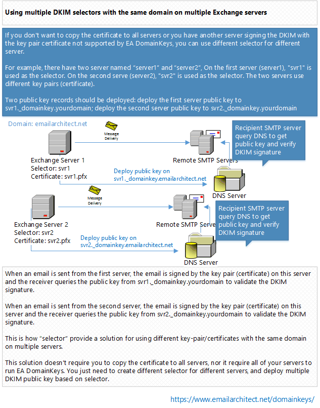

This solution doesn't require you to copy the certificate to all servers, 
nor it require all of your servers to run EA DomainKeys. 
You just need to create different selector for different servers, and deploy 
multiple DKIM public key based on selector.

Finally, I will introduce how to sign DKIM onbehalf customer domain.

Using Sender Rule
------------------

Sometimes you need to send an email with sender address not hosted by your server. 
In this case, you cannot set DKIM signature for such email, as you don't have permission 
to deploy the DKIM public key to the domain not hosted by your DNS server.

The typical usage is email forwarding. For example, one remote email is delivered to your 
local user mailbox, but your local user set email forwarding to another remote address. 
With sender rule, you can re-sign DKIM by your domain and also change MAIL FROM to comply
with SPF record.

.. note:: If you don't send email from outside email address, or you don't need to 
  sign the DKIM for those emails, you can simply ignore this topic.

How to use Sender Rule
^^^^^^^^^^^^^^^^^^^^^^^^

Here is the scenario. You own a domain ``emailarchitect.net`` and you have DKIM/DomainKeys for 
``emailarchitect.net`` set on your server. There is no problem when you send emails with sender
``*@emailarchitect.net``, the email should be signed correctly. At the same time, your customer 
requested you to send emails with sender ``*@adminsystem.com`` and sign the DKIM/DomainKeys 
signature for outgoing emails. As ``adminsystem.com`` is your customer domain and you don't 
have permission to deploy the public key to ``adminsystem.com`` DNS server, you have to use sender rule.

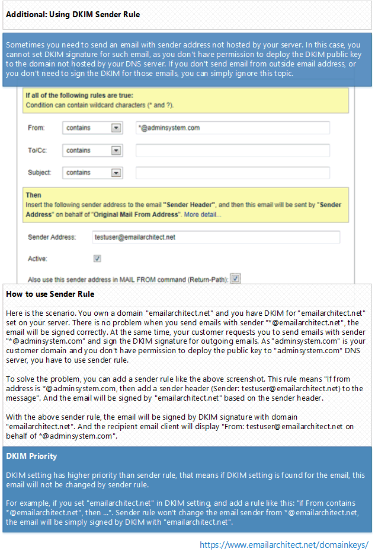
  
To solve the problem, you can add a sender rule like the above screenshot. This rule means 
"If from addess is ``*@adminsystem.com``, then add a sender header (Sender: ``testuser@emailarchitect.net``) 
to the message". And the email will be signed by ``emailarchitect.net`` based on the sender header.

With the above sender rule, the email will be signed by domain ``emailarchitect.net``. 
And the recipient email client will display "From: ``testuser@emailarchitect.net`` 
on behalf of ``*@adminsystem.com``".

Use Reply-To header instead of Sender header
^^^^^^^^^^^^^^^^^^^^^^^^^^^^^^^^^^^^^^^^^^^^^

If you also check "Use Reply-To header instead of Sender header", And the recipient email client will display:

.. code-block:: batch

  Reply-To: *@adminsystem.com (original sender address)
  From: testuser@emailarchitect.net
                   
.. attention:: If you only input domain in Sender Address, the email will be signed by the domain directly without
  changing sender or reply-to header.

     
DKIM Priority
--------------

DKIM setting has higher priority than sender rule, that means 
if DKIM setting is found for the email, this email will not be changed by sender rule.

For example, if you set ``emailarchitect.net`` in DKIM setting, and add a 
rule like this: ``if From contains *@emailarchitect.net", then ...``. Sender 
rule won't change the email sender from ``*@emailarchitect.net``, the email is 
simply signed by DKIM with ``emailarchitect.net``.